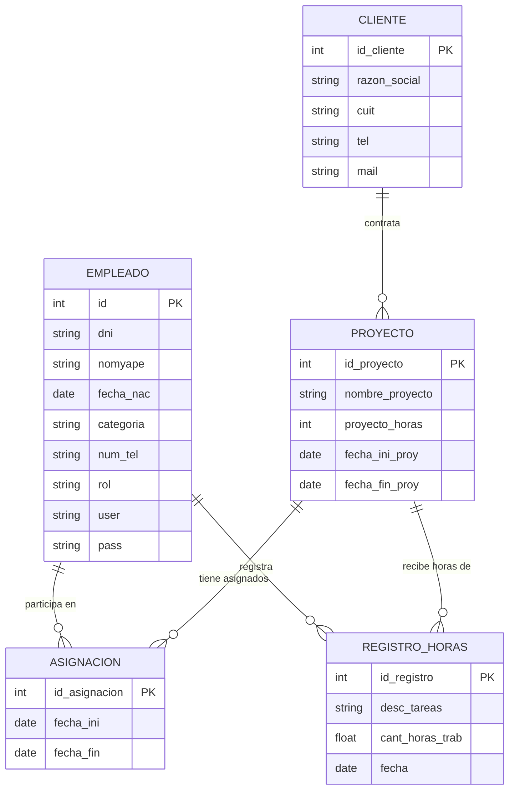

# Propuesta TP DSW 2026 - COM 305 - GesThor

## Grupo
### Integrantes
* 43187 - Tisocco, Lucas Maximiliano
* 51315 - Pontelli, Juan Martin
* 42786 - Cuesta, Juan Ignacio
* 41421 - Romero, Emmanuel Nicolas

### Repositorios
* [frontend app](http://hyperlinkToGihubOrGitlab)
* [backend app](http://hyperlinkToGihubOrGitlab)

## Tema
### Descripción
Sistema de gestión de recursos humanos orientado al control de horas laborales en entornos de consultoría y servicios profesionales. El sistema contempla dos perfiles de usuario: administrador (RRHH) y empleado, cada uno con credenciales de acceso propias y funcionalidades diferenciadas según su rol. Los empleados registran sus horas laborales diarias asociadas a proyectos de clientes, mientras que el administrador supervisa y valida dichas cargas horarias, monitorea el estado de avance de los proyectos y gestiona la asignación de personal. El sistema incluye además un contador de horas diarias disponibles por empleado, facilitando el seguimiento de la capacidad operativa del equipo.

### Modelo

## Alcance Funcional 

### Alcance Mínimo

Regularidad:
|Req|Detalle|
|:-|:-|
| CRUD simple | 1. CRUD Empleado   2. CRUD Cliente   3. CRUD Categoría de Empleado |
| CRUD dependiente | 1. CRUD Proyecto {depende de} CRUD Cliente   2. CRUD Asignación {depende de} CRUD Empleado y CRUD Proyecto   3. CRUD Registro de Horas {depende de} CRUD Empleado y CRUD Proyecto |
| Listado + detalle | 1. Listado de proyectos filtrado por cliente, muestra nombre del proyecto, fechas y horas estimadas => detalle muestra datos completos del proyecto, cliente y empleados asignados   2. Listado de registros de horas filtrado por empleado y rango de fecha, muestra nombre del empleado, proyecto, fecha y horas cargadas => detalle muestra descripción completa de la tarea |
| CUU/Epic | 1. Registrar horas trabajadas en un proyecto (Empleado)   2. Asignar empleado a un proyecto (Admin RRHH)   3. Verificar y aprobar carga horaria de un empleado (Admin RRHH)   4. Consultar resumen de horas por proyecto (Admin RRHH) |

Adicionales para Aprobación
|Req|Detalle|
|:-|:-|
| CRUD | 1. CRUD Empleado   2. CRUD Cliente   3. CRUD Categoría de Empleado   4. CRUD Proyecto   5. CRUD Asignación   6. CRUD Registro de Horas |
| CUU/Epic | 1. Registrar horas trabajadas en un proyecto (Empleado)   2. Asignar empleado a un proyecto (Admin RRHH)   3. Verificar y aprobar carga horaria de un empleado (Admin RRHH)   4. Consultar resumen de horas por proyecto (Admin RRHH)   5. Login con autenticación propia y control de acceso por rol (Admin / Empleado) |

### Alcance Adicional Voluntario

|Req|Detalle|
|:-|:-|
| Listados | 1. Dashboard de horas por proyecto filtrado por mes, muestra empleados, horas cargadas y porcentaje de avance sobre el estimado   2. Historial de asignaciones de un empleado, muestra proyectos en los que participó con fechas y horas totales registradas  3. Notificacion por email al empleado confirmando aprobacion de horas laborales |
| CUU/Epic | 1. Notificación por email al empleado cuando es asignado a un proyecto   2. Exportar reporte de horas de un proyecto en formato CSV  4. Notificacion por correo para reestablecer la contraseña|
| Otros | 1. Contador de horas diarias disponibles por empleado con alerta visual al superar el límite |

